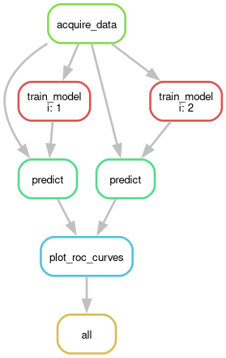

<div align="center">

# Digit Classification

[](https://www.python.org/)
[](https://pytorch.org/)
[](https://lightning.ai/)
[](https://hydra.cc/)
[](https://wandb.ai)
[](https://snakemake.readthedocs.io/)
[](https://www.pyinvoke.org/)
</div>

This is an example application of the RODEM machine learning template, using a
CNN classifier for MNIST digit classification.
It relies on pytorch and lightning for machine learning, wandb for experiment
tracking, hydra for configuration management, snakemake for workflow management
and invoke as a project cli.

## Usage

After cloning the example branch of this repo:
```
git clone -b example https://gitlab.cern.ch/rodem/projects/projecttemplate/ <repo_name>
cd <repo_name>
```
to run the example workflows in this repo on an HPC cluster with slurm installed,
start by setting up a virtual environment:
```
python -m venv <env_path>
source <env_path>/bin/activate
pip install --upgrade pip
pip install -r workflow_requirements.txt
```
You might have to make sure that your python version, with which you setup the
environment, is high enough.

Next make your wandb api key available, by copy-pasting it after running
```
read -s WANDB_API_KEY; export WANDB_API_KEY
```

Now we can start the actual workflow.
This could be done with snakemake directly, but is a bit more convenient with invoke.
The latter simply provides a python wrapper around snakemake in `tasks.py` which neatly
documents the actually used commands and flags.
To run the main workflow with invoke type
```
inv experiment-run --name=<exp_name> --group=<exp_group> --profile=exp --stage=experiment
```
where `<exp_name>` and `<exp_group>` are mainly used to define the output directory of
the experiment we want to run, which will be `experiments/<exp_group>/<exp_name>`.
The profiles are defined in `workflow/profiles/` and are used to set specific snakemake
flags.
Two profiles are provided, `exp` and `test`, which run a workflow either as automatically
launched slurm jobs or in an interactive session, where parallelization is solely done
through CPU cores.
Finally, we can use the stage flag to indicate if this is actually a serious
experiment or if we are just debugging (`--stage=debug`).
Here this only sets an appropriate tag for the wandb run.
Now, invoke will call snakemake under the hood, which in turn runs the
workflow defined in `workflow/main.smk`:



As you can see, this workflow will train two models, which differ by the number of hidden channels
in the convolution layers, predict labels from both models and plot ROC curves.
The all rule is simply the last rule and defines all output files that should be present.
The resulting plots can be found in `experiments/<exp_group>/<exp_name>/results/roc_curves.pdf`.

This repository also comes with an example sweep workflow, which uses
wandb sweeps to make a hyperparameter search.
To execute this one, run
```
inv experiment-run --workflow=sweep --name=<exp_name> --group=<exp_group> --profile=exp --stage=experiment
```
where we only added `--workflow=sweep` to the previous command.
This will launch a hyperparameter search over previously defined parameters
in `workflow/config/sweep.yaml` and save the results with wandb.

## Docker and Gitlab

This project is setup to use the CERN GitLab CI/CD to automatically build a Docker image based
on the `docker/Dockerfile` and `requirements.txt`.
It will also run the pre-commit as part of the pipeline.
To edit this behaviour change `.gitlab-ci`

## Contributing

Contributions are welcome! Please submit a pull request or create an issue if you have any improvements or suggestions.
Please use the provided `pre-commit` before making merge requests!

## License

This project is licensed under the MIT License. See the LICENSE file for details.
